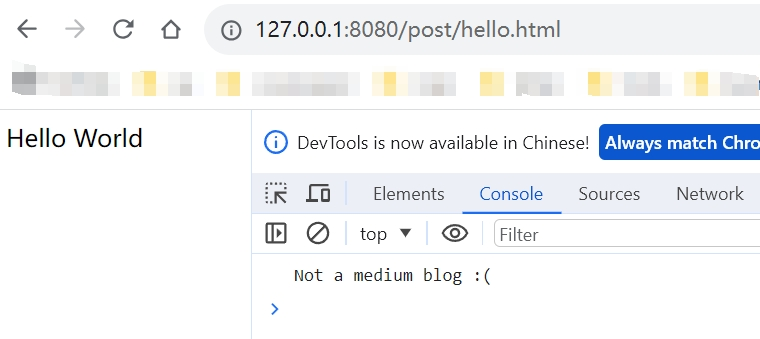

# Yew Router Path Cannot Captured

This repository shows router path cannot be captured if there is already some static html occupying that path.

For example, a static html file is put at path `/post/hello.html`, and this will make route matching description `Route::Post` unmatchable 

```rust
#[derive(Clone, Routable, PartialEq)]
enum Route {
    #[at("/")]
    Home,
    #[at("/post/:id")]
    Post { id: String },
    #[not_found]
    #[at("/404")]
    NotFound,
}
```

## 1. Environment
 - Yew version: v0.21.0
 - Yew Router version: v0.18.0
 - Rust version: 1.73.0
 - Target, if relevant: `wasm32-unknown-unknown`
 - Build tool, if relevant: `trunk`
 - OS, if relevant: Debian GNU/Linux 11 (bullseye)
 - Browser and version, if relevant: Chrome 120.0.6073.0 64-bits

## 2. Steps to reproduce

1. Install tools
    ```bash
    rustup target add wasm32-unknown-unknown

    cargo install trunk wasm-bindgen-cli
    ```
2. Start the server
    ```bash
    trunk serve
    ```
3. Visit `http://127.0.0.1:8080/post/hello.html`，and check log in Console of DevTools.

## 3. Expected behavior

See logs `post id=hello.html` in Console

## 4. Screenshots

.

